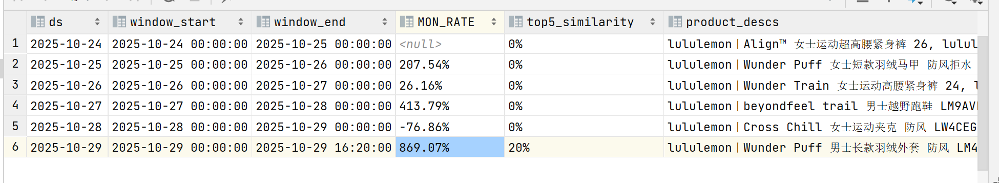

Doris指标已完成
with t1 as (
SELECT
ds,
str_to_date(window_start, 'yyyy-MM-dd HH:mm:ss') AS window_start,
str_to_date(window_end, 'yyyy-MM-dd HH:mm:ss') AS window_end,
win_gmv,
top5_product_ids
FROM report_lululemon_window_gmv_topN
ORDER BY ds
),
t2 as (
SELECT
*,
row_number() OVER (PARTITION BY ds ORDER BY window_end DESC) AS rn
FROM t1
),
t3 as (
SELECT
*
FROM t2
WHERE rn = 1
),
t4 as (
(
select
ds,
window_start,
window_end,
win_gmv,
top5_product_ids,
product_id
from t3
lateral view explode_split(top5_product_ids, ',') tmp as product_id
WHERE top5_product_ids IS NOT NULL
AND top5_product_ids != '数据缺失'
AND trim(product_id) != '数据缺失'
)
),
t5 as (
select
ds,
window_start,
window_end,
win_gmv,
top5_product_ids,
b.product_desc
from t4 as a
left join pg_catalog.public.spider_lululemon_jd_product_dtl as b
on a.product_id = b.product_id
),
t6 as (
select
ds,
window_start,
window_end,
win_gmv,
top5_product_ids,
GROUP_CONCAT(product_desc, ', ') AS product_descs
from t5
group by ds,window_start,window_end,win_gmv,top5_product_ids
),
t7 as (
select
*,
concat(round((win_gmv - lag(win_gmv,1,0) over (order by ds)) / lag(win_gmv,1,0) over (order by ds) * 100,2),'%') as MON_RATE
from t6
),
t_overlap as (
select
cur.ds as ds,
count(distinct cur.product_id) as overlap_count
from t4 cur
join t4 prev
on cur.product_id = prev.product_id
-- 将 cur.ds 的前一天格式化成与 prev.ds 相同的字符串格式
and prev.ds = date_format(date_sub(str_to_date(cur.ds,'yyyy-MM-dd'), 1), 'yyyy-MM-dd')
group by cur.ds
),
/* 最终表：把 overlap_count join 回来并计算相似度 */
t8 as (
select
t7.*,
coalesce(o.overlap_count, 0) as overlap_count,
case
when top5_product_ids IS NULL OR top5_product_ids = '' then '0%'
else concat(
round(
coalesce(o.overlap_count,0)
/ cast(length(top5_product_ids) - length(replace(top5_product_ids, ',', '')) + 1 as double)
* 100
,2)
, '%')
end as top5_similarity
from t7
left join t_overlap o
on t7.ds = o.ds
)
select *
from t8
order by ds;
