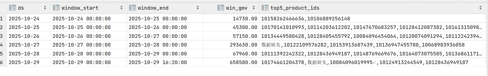

Kafka_To_Doris 数据完成
正在进行drois指标

with t1 as (
SELECT
ds,
str_to_date(window_start, 'yyyy-MM-dd HH:mm:ss') AS window_start,
str_to_date(window_end, 'yyyy-MM-dd HH:mm:ss') AS window_end,
win_gmv,
top5_product_ids
FROM report_lululemon_window_gmv_topN
ORDER BY ds
),
t2 as (
SELECT
*,
row_number() OVER (PARTITION BY ds ORDER BY window_end DESC) AS rn
FROM t1
),
t3 as (
SELECT *
FROM t2
WHERE rn = 1
)
select ds, window_start, window_end, win_gmv, top5_product_ids
from t3
order by ds
;

